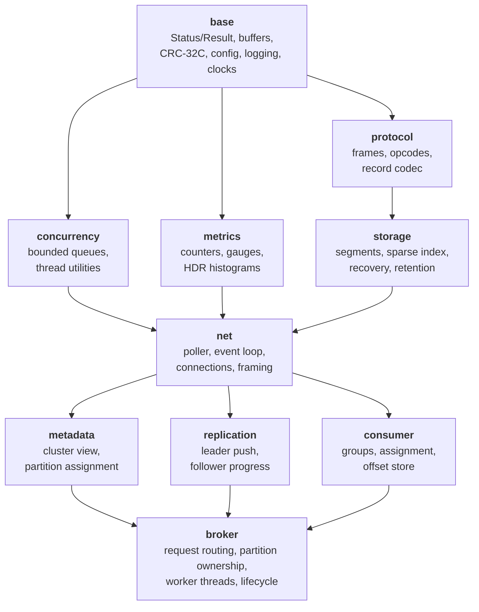
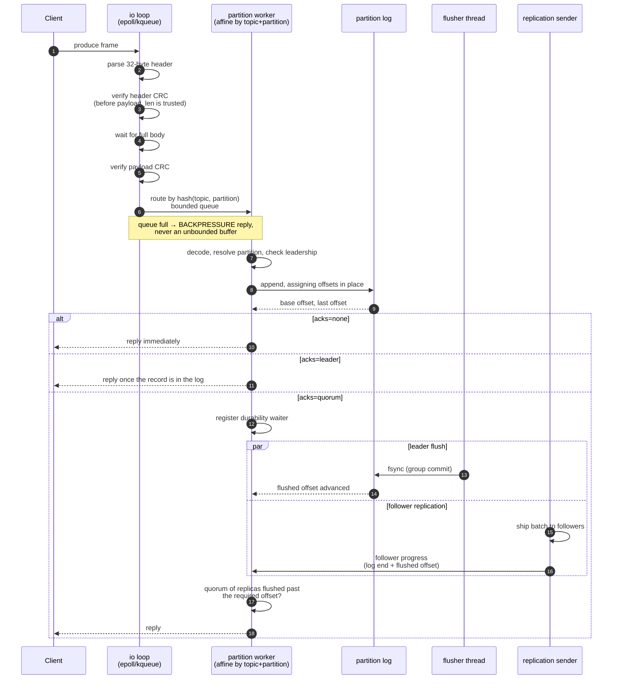

# PulseLog Architecture

PulseLog is a partitioned, replicated, append-only event log with a custom
binary protocol and a custom asynchronous networking layer. Nothing on the data
path wraps an existing broker or an existing storage engine.

This document describes the module layering, the process model, the request
lifecycle, and where the design deliberately stops short of what a production
Kafka deployment provides.

---

## 1. Module layering

Modules are separate CMake targets so the dependency direction is enforced by
the build, not by convention. An arrow means "depends on".



The `broker` target is split internally into `broker_core` and `broker` to
break a cycle: replication needs to read a partition replica, and the broker
needs to drive replication. `broker_core` holds the partition types both sides
share.

`storage` cannot include anything from `net`; `protocol` knows nothing about
either. That keeps the log engine testable without a socket and the codec
testable without a disk.

---

## 2. Process model

One broker is one process. Inside it:

```
                    ┌──────────────────────────────────────────┐
                    │              broker process              │
   TCP  ┌────────┐  │  ┌────────────┐        ┌──────────────┐  │
  ──────▶│accept  │──┼─▶│ io loop 0  │───┐    │  worker 0    │  │──▶ partition
        │(listener)│ │  ├────────────┤   │    ├──────────────┤  │    logs owned
   TCP  │          │ │  │ io loop 1  │───┼───▶│  worker 1    │  │    exclusively
  ──────▶│         │ │  ├────────────┤   │    ├──────────────┤  │    by one
        └────────┘  │  │ io loop N  │───┘    │  worker M    │  │    worker
                    │  └────────────┘         └──────────────┘  │
                    │        ▲                       │          │
                    │        └──── completion ───────┘          │
                    │                                            │
                    │  ┌─────────┐ ┌───────────┐ ┌────────────┐ │
                    │  │ flusher │ │ replicator│ │ maintenance│ │
                    │  └─────────┘ └───────────┘ └────────────┘ │
                    └──────────────────────────────────────────┘
```

* **IO loops** (`net`): N threads, each owning a poller (`kqueue` on macOS,
  `epoll` on Linux) and a disjoint set of connections. A connection is bound to
  one loop for its entire life, so connection state needs no locking. New
  connections are handed to the least-loaded loop at accept time.
* **Partition workers** (`broker`): M threads. Every partition is owned by
  exactly one worker, chosen by `hash(topic, partition) % M`. All log mutation
  for a partition happens on its worker, so the log itself has no lock.
* **Flusher** (`storage`): batches `fsync` across partitions on an interval or
  byte threshold, so a burst of small appends costs one fsync rather than one
  per record.
* **Replicator** (`replication`): leader-side streaming of log entries to
  followers and follower-side fetch loops.
* **Maintenance**: retention enforcement, segment deletion, consumer-group
  session expiry, metric aggregation.

The two-stage split (IO loop → worker → IO loop) means neither side blocks the
other: a slow disk stalls one worker, not the socket that fed it.

---

## 3. Request lifecycle: produce



The four stages the broker times separately map onto this diagram: **queue
wait** is step 6 to step 7, **append** is step 8, **local flush** is the
leader's `fsync` branch, and **replication** is the wait for follower progress
after the leader has flushed. Their measured split is in
[PERFORMANCE_RESULTS.md §5.1](PERFORMANCE_RESULTS.md#51-the-stage-breakdown).

Backpressure is applied at the "route by partition" step: the per-worker queue
is bounded, and a full queue produces a `BACKPRESSURE` response rather than an
unbounded memory build-up. The io loop also stops reading from a connection
whose pending-response bytes exceed a per-connection budget.

---

## 4. Storage

See [STORAGE_ENGINE.md](STORAGE_ENGINE.md). Summary:

* A partition is a directory of segments: `<base_offset>.log` (records),
  `<base_offset>.index` (sparse offset → file position), `<base_offset>.tindex`
  (sparse timestamp → offset).
* Records carry a length, CRC32C, timestamp, key and value.
* Recovery scans the active segment's tail, stops at the first record that
  fails length or CRC validation, and truncates there. A record is either
  wholly present and valid, or gone.
* Sparse indexes mean an offset lookup is a binary search over a small array
  followed by a short forward scan.

---

## 5. Replication

See [REPLICATION.md](REPLICATION.md). Summary: static leader assignment from
the cluster config, leader-push streaming to followers, per-follower LEO
tracking, and a high-water mark that consumers cannot read past. Quorum acks
wait for a majority of the replica set to persist the record.

What PulseLog does **not** do in this version: automatic leader election.
Leadership is assigned statically, so the loss of a leader makes its partitions
unavailable for writes until the process returns. The Raft design that would
lift that restriction is written up in REPLICATION.md but is not implemented.

---

## 6. Consumer groups

See the "Consumer groups" section of [FAILURE_SEMANTICS.md](FAILURE_SEMANTICS.md).
Group state lives on a coordinator broker chosen by hashing the group ID.
Members join, receive a deterministic partition assignment (range or
round-robin), heartbeat to hold their session open, and commit offsets to an
internal durable log. Delivery is **at-least-once**.

---

## 7. Where the design stops

These are limitations of the implementation, not of the documentation:

| Area | Current behaviour |
|---|---|
| Leader election | Static assignment; no automatic failover |
| Consistency | Quorum acks give durability, not linearizable reads |
| Security | No TLS, no authentication |
| Rebalancing | Stop-the-world, not incremental/cooperative |
| Transactions | None; no exactly-once |
| Tiered storage | None; retention deletes segments |

Each is listed with its consequences in [FAILURE_SEMANTICS.md](FAILURE_SEMANTICS.md).
