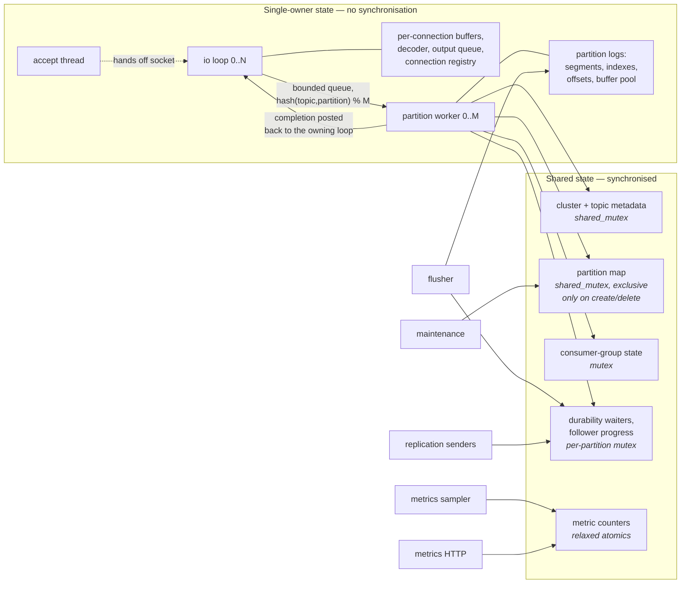

# PulseLog Concurrency Model

Who owns what, which memory orderings are used and why, and how everything
stops. The organising principle is **ownership over locking**: most state has
exactly one thread that may touch it, so most of the system needs no
synchronisation at all.

---

## 1. Thread inventory

One broker process runs:

| Threads | Name | Owns | Blocks on |
|---:|---|---|---|
| 1 | `pl-accept` | The listening socket | `kevent`/`epoll_wait` |
| N | `pl-io-<i>` | A disjoint set of connections | `kevent`/`epoll_wait` |
| M | `pl-worker-<i>` | A disjoint set of partitions | Its request queue (spin, then condvar) |
| 1 | `pl-flusher` | Nothing; calls `fsync` | `sleep_for(flusher_interval)` |
| 1 | `pl-maint` | Nothing; retention, session expiry, waiter timeouts | `sleep_for(100ms)` |
| 1 | `pl-metrics-sample` | The process-stats sampler | `sleep_for(sample_interval)` |
| 1 | `pl-metrics` | The HTTP scrape socket | `poll` |
| R | `pl-repl-<peer>` | One connection to one peer broker | Its condvar, or the replication interval |

Defaults are N = M = 2. Every thread is owned by a component that joins it in
its destructor. **No thread is ever detached**, so shutdown is deterministic and
no thread can outlive the state it points at.

---

## 2. Ownership map



Solid arrows are the only paths that cross a thread boundary. Everything inside
the left box is reached by exactly one thread and needs no synchronisation at
all; everything in the right box names the primitive that guards it.

The flusher and the replication senders touch partition logs that a worker
owns. That is the one exception, and §4 is the argument for why it is safe:
they only ever read below `end_position_`, which the writer publishes with a
release store after the data is in place.

| State | Owner | How others reach it |
|---|---|---|
| A connection's buffers, decoder, output queue | Its io loop thread | Not at all |
| A partition's log (segments, indexes, offsets) | Its worker thread | Read-only, under the safety argument in §4 |
| The per-io-loop connection registry | That io loop thread | Not at all |
| A worker's buffer pool | That worker | Not at all |
| Cluster/topic metadata | Shared | `shared_mutex` |
| The partition map | Shared | `shared_mutex`, exclusive only on create/delete |
| Consumer-group state | Shared | One `mutex` |
| Durability waiters, follower progress | Shared | Per-partition `mutex` |
| Metric counters and histograms | Shared | Relaxed atomics |

**A partition is owned by exactly one worker**, chosen by
`hash(topic, partition) % worker_count`. Hashing rather than round-robin makes
the mapping stable across restarts and identical on every broker, so a
partition's behaviour is reproducible between benchmark runs.

That single decision is what removes the lock from the append path: the log has
one writer, so appending is a `pwrite` and two atomic stores.

---

## 3. Request lifecycle across threads

```
io thread                        worker thread                  io thread
---------                        -------------                  ---------
decode frame
  |
  +-- copy payload into a
  |   pooled buffer  ............ (the one copy on this path)
  |
  +-- MPMC queue push ---------->  pop
                                    |
                                    +-- rewrite offsets in place
                                    +-- pwrite to the segment
                                    +-- publish end_position (release)
                                    +-- register a durability waiter
                                            |
                     flusher / follower ack -+
                                            |
                                    +-- run the completion callback
                                            |
                                     PostTask -------------------> send response
```

The payload is copied exactly once, at the io-to-worker boundary, because the
connection's read buffer is reused the moment the frame callback returns. The
buffer comes from the worker's own pool, so it allocates only when the pool is
empty. Everything downstream — decoding, offset assignment, the write — works
in place on that buffer.

A response goes back by posting a task onto the io loop that owns the
connection. The task looks the connection up by ID in that loop's registry; if
the client disconnected, the entry is gone and the response is dropped. There is
no dangling pointer, and no lock, because that registry is touched only by its
own loop thread.

---

## 4. Reading a log while it is being written

Fetch handlers and replication senders read a partition's log from threads that
do not own it. That is safe because of three facts, in this order:

1. **Appends only extend.** Written bytes are never modified. There is no
   in-place update to race with.
2. **`end_position_` is published with a release store** after the `pwrite`
   returns, and read with an acquire load. A reader that observes position P has
   also observed every byte before P.
3. **Index entries are appended before the position that would expose them**,
   so an index lookup never points past valid data.

`fsync(2)` on a descriptor is safe concurrently with `pwrite(2)` on the same
descriptor and flushes whatever had been written when it started, which is why
the flusher needs no coordination with the writer. (It does interact at the
*filesystem* level — see PERFORMANCE_RESULTS.md §5 — but not at the correctness
level.)

The segment *list* is guarded by a `shared_mutex`, taken exclusively only when
the list changes: a roll or a retention deletion. Both are rare compared with
reads.

---

## 5. Memory ordering, and why each one

Every non-relaxed ordering in the codebase exists for a stated reason.

### `end_position_` — release/acquire

```cpp
// writer                                 // reader
pwrite(...);                              const auto limit =
end_position_.store(p, release);            end_position_.load(acquire);
                                          // bytes < limit are fully written
```

Release/acquire is the whole safety argument of §4. Relaxed would allow a
reader to see the new position before the bytes it describes.

### `next_offset_`, `flushed_offset_`, `high_water_mark_` — release/acquire

Same pattern. `high_water_mark_` additionally must never move backwards: a
consumer that read up to it would otherwise see records disappear after a
leadership change, so the recompute takes the maximum of the old and new value.

### SPSC ring — release/acquire on the indices

The producer's release store on `write_index_` pairs with the consumer's
acquire load, making slot construction visible before the index that exposes
it. Each index sits on its own cache line: without the padding, the producer's
store invalidates the line the consumer is reading, and vice versa.

### Bounded MPMC queue — acquire/release on cell sequences, `acq_rel` CAS on positions

Each cell carries a sequence number acting as a ticket. Producers acquire the
cell, construct, then release-store `sequence = position + 1`, publishing the
payload; consumers do the mirror image. The position counters use relaxed loads
and an `acq_rel` CAS: their only job is to hand out distinct tickets, and all
payload visibility comes from the per-cell sequence.

### Metrics counters — relaxed

A counter that is a few increments stale in a scrape is not a correctness
problem, and metrics must not add ordering constraints to the paths they
measure. Counters and gauges are cache-line aligned so that counters updated by
different threads do not share a line.

### `stopping_` flags — `acq_rel` exchange

Shutdown must be idempotent and safe from any thread. `exchange(true, acq_rel)`
returning false is what makes exactly one caller perform the teardown.

---

## 6. Lock-free claims, stated precisely

| Structure | Claim | Basis |
|---|---|---|
| `SpscRing` | **Wait-free** for push and pop | Fixed instruction count, no loops, no CAS. Holds only with exactly one producer and one consumer thread; using it with more is undefined |
| `BoundedMpmcQueue` | **Lock-free**, not wait-free | Each operation has a CAS retry loop, so an individual thread can be starved in principle; system-wide progress is guaranteed because a failed CAS means another thread succeeded. No operation blocks |
| `BoundedBlockingQueue` | Not lock-free, and not claimed to be | Mutex + condition variable. Present because sometimes blocking is what you want, and as the baseline the other two are measured against |
| `BufferPool` | Not lock-free | A mutex. Acquisition happens once per request, not once per record; a lock-free free list was considered and the mutex measured at 20 ns, so the complexity was not justified |

Nothing else in the codebase is described as lock-free.

---

## 7. Busy-waiting, and where it is bounded

Spinning appears in exactly two places, both bounded:

* **The MPMC queue's CAS retry loop.** Contention is over one cell; the
  expected retry count is small.
* **`PartitionWorker`'s empty-queue path.** It spins for 8 escalating steps
  (up to ~63 `CpuRelax` instructions each), then sleeps on a condition variable
  with a **200 µs timeout**.

That timeout is the interesting choice. Making the wakeup airtight would mean
taking the sleep mutex on the submit path — putting a lock on every io loop's
hot path to save at most 200 µs of latency in the rare case where a worker went
to sleep exactly as work arrived. The timeout bounds the cost of a missed
wakeup instead. Under load the queue is rarely empty, so this path is mostly
untaken.

`Backoff::Pause()` emits the architecture's spin hint (`PAUSE` on x86, `YIELD`
on AArch64), escalates to `std::this_thread::yield`, and finally sleeps.

---

## 8. Race prevention, concretely

| Hazard | How it is prevented |
|---|---|
| A handler destroying itself inside its own callback | `EventLoop::CloseHandler` defers destruction to the end of the iteration |
| A worker posting a response to a destroyed event loop | `TcpServer::Stop()` leaves the loops alive (stopped, so `PostTask` returns false); destruction happens in the destructor, which the broker reaches only after joining its workers. **This was a real segfault**, reproducible about 1 run in 10 under load |
| A completion callback re-entering the partition mutex | Callbacks always run *outside* the lock: satisfied waiters are moved into a local vector, the lock is released, then they run |
| A follower's stale progress report moving its offset backwards | Recorded progress takes the maximum of the old and new value |
| Two brokers creating the same topic differently | Topic creation has exactly one owner, the controller. **This was a real bug**: metadata lookups on non-controller brokers auto-created the same topic with a different partition count |
| Cross-thread payload lifetime | The payload is copied into a pooled buffer owned by the request before it crosses a thread boundary |

---

## 9. Shutdown order

`Broker::Stop()` runs this sequence, and the order is load-bearing:

1. `server_->Stop()` — stop accepting, close connections, join io threads. The
   loops stay alive.
2. `replicator_->Stop()` — join every replication sender before the partitions
   they read from can go away.
3. `workers_->Stop()` — each worker **drains its queue** rather than dropping
   it, so in-flight requests get a real answer. Responses posted at this point
   hit a stopped loop and are dropped, which is logged.
4. Join the flusher, maintenance and metrics threads.
5. Stop the metrics endpoint.
6. Persist metadata; flush and close the consumer-offset log.
7. `partitions_.Close()` — fail every outstanding durability waiter with
   `UNAVAILABLE`, flush, close.
8. Destroy the workers, then the server (which now destroys the loops), then
   everything else.

Every step is idempotent, and `Stop()` itself is safe to call from any thread
and any number of times.

---

## 10. Testing the model

* `tests/unit/test_queues.cc` runs the queues under real contention and asserts
  **conserved quantities** — every item consumed exactly once, sums matching —
  rather than timings, so the outcome is deterministic even though the
  interleavings are not.
* `tests/integration/` runs whole brokers in-process, so ThreadSanitizer sees
  every thread in the system at once rather than one component in isolation.
* CI runs the full suite under ThreadSanitizer and under
  AddressSanitizer + UndefinedBehaviorSanitizer.
