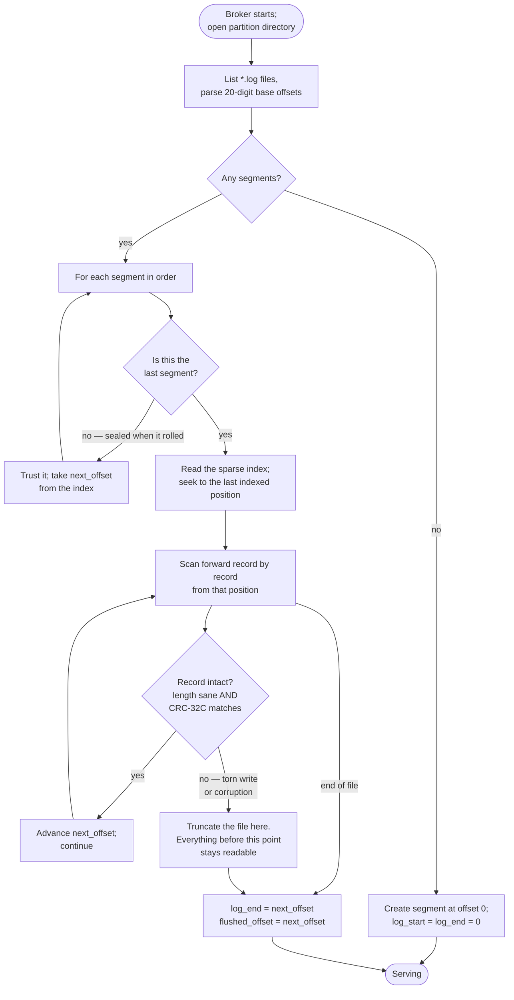

# PulseLog Storage Engine

An append-only, segmented log per partition. This document describes the
on-disk layout, the indexing scheme, what recovery guarantees, and the
measured basis for the I/O choices.

---

## 1. On-disk layout

```
<data.dir>/
  orders-0/
    00000000000000000000.log      records
    00000000000000000000.index    sparse offset index
    00000000000000000000.tindex   sparse timestamp index
    00000000000000131072.log
    00000000000000131072.index
    00000000000000131072.tindex
  orders-1/
    ...
```

The file stem is the segment's **base offset**, zero-padded to 20 digits so
lexical order equals numeric order — `ls` and `readdir` return segments in log
order without a numeric sort.

### Record

Identical to the wire format (see [PROTOCOL.md](PROTOCOL.md) §3):

```
length u32 | crc32c u32 | offset i64 | timestamp i64 | attributes u8 |
key_len varuint | value_len varuint | key | value
```

25 fixed bytes plus two varints: **27 bytes of framing** for a record with a
short key. `tests/unit/test_record.cc` asserts that number so this document
cannot drift from the code.

Two decisions worth stating explicitly:

* **The length prefix sits outside the CRC.** It is validated structurally
  instead — minimum size, maximum size, and the requirement that the key and
  value lengths exactly fill the declared record. A corrupt length is therefore
  rejected before the CRC is consulted, which matters because you cannot
  checksum a region whose extent you do not yet trust.
* **The offset is stored, not inferred.** It costs 8 bytes per record. In
  exchange the log is self-describing: recovery detects a discontinuity
  directly, a follower validates a replicated batch without consulting an
  index, and a hex dump tells you exactly which offsets survived a torn write.

### Offset index

Fixed 8-byte entries, both fields relative to the segment base:

```
relative_offset u32 | file_position u32
```

Sparse: one entry per `index_interval_bytes` of log (4 KiB default), not one
per record. A 128 MiB segment needs ≈ 32 KiB of index.

Relative 32-bit fields halve the entry size versus absolute 64-bit ones, which
doubles the entries per cache line during the binary search. The cost is a hard
4 GiB cap on a segment's size, enforced in `PartitionLog::MaybeRoll` regardless
of configuration.

Because the index is small it is **read into a vector once at open** and
appended to as it grows. There is no mmap on the lookup path and therefore no
page fault inside a fetch. A lookup is:

1. binary search the vector for the largest entry with `offset ≤ target`;
2. forward-scan the log from that position, hopping record to record by the
   length prefix, until the target offset.

The scan is bounded by `index_interval_bytes` by construction.

### Timestamp index

`timestamp i64 | relative_offset u32`, also sparse, used only by
`LIST_OFFSETS` with a timestamp. Producer clocks are not trustworthy, so a
record whose timestamp goes backwards is simply **not indexed** rather than
allowed to break the binary-search invariant. Time lookups then resolve to a
slightly earlier offset — the safe direction, since a consumer sees extra
records rather than missing ones.

---

## 2. Write path

```
produce frame arrives
  → frame payload CRC verified (protocol layer)
  → records parsed for structure, in place, in the connection's read buffer
  → each record's offset (and timestamp, if unset) rewritten in place
  → each record's CRC recomputed
  → one write(2) of the whole batch into the active segment
  → index entry appended if ≥ index_interval_bytes since the last one
  → end_position published with a release store
```

**The produce path performs no copy of record payloads.** Records are rewritten
in the buffer the socket read them into and written to the file from there. The
per-record work is one 8-byte store, one 8-byte store, and one CRC-32C over the
record body.

The producer's own record checksums are neither trusted nor reused. The frame's
payload CRC already proved transport integrity for the whole batch, and the
records are about to be modified, so the broker computes the at-rest checksums
itself.

### Write modes

`storage.write_mode` selects how appends reach the file:

| Mode | Behaviour |
|---|---|
| `write` | one `pwrite(2)` per append |
| `writev` | one `pwritev(2)` for several batches at once, so the broker can coalesce multiple produce requests for the same partition without first copying them into a shared buffer |
| `mmap` | append into a mapped window |

Measurements are in [PERFORMANCE_RESULTS.md](PERFORMANCE_RESULTS.md); the
default there is the one the numbers support, not a guess.

### Preallocation

New segments are preallocated to `segment_bytes` (`posix_fallocate` on Linux,
`F_PREALLOCATE` on macOS, `ftruncate` fallback). This avoids a metadata update
per append and reduces fragmentation. The unused tail is trimmed when the
segment is closed or rolled, so on-disk sizes stay honest.

A preallocated tail reads as zeros, which parse as a zero-length record with a
zero offset. Recovery therefore stops at the first record whose offset does not
continue the sequence, not merely at the first parse failure.

---

## 3. Durability

`flush.sync_on_append` picks between two very different promises:

| Setting | A leader ack means | Survives process crash | Survives machine crash |
|---|---|---|---|
| `true` | bytes are on stable media | yes | yes |
| `false` (default) | bytes are in the page cache | yes | only if the flusher ran |

With `false`, the flusher syncs when any of `flush.interval_ms`,
`flush.max_unflushed_bytes` or `flush.max_unflushed_records` trips. The
exposure window is bounded by whichever fires first.

`flushed_offset` is captured **before** the fsync is issued and published after
it returns, so it never claims more than the syscall actually covered.

On macOS `fsync(2)` only pushes to the drive's write cache; `F_FULLFSYNC` is
used instead to reach stable media. It is substantially slower, and that shows
up directly in durable-mode latency numbers.

Directory entries are fsynced when a segment is created. Without that, a power
cut can lose a segment whose *contents* were fsynced — the file would simply
not be in its directory.

---

## 4. Recovery



Recovery scans forward from the **last index entry**, not from the start of the
segment, which is why recovery time tracks the sparse index interval rather
than the size of the log. Measured: 0.052 s to serve a 205,000-record log again
after `SIGKILL` ([PERFORMANCE_RESULTS.md §3.1](PERFORMANCE_RESULTS.md#31-linux-x86-64-primary)).

Only the last segment can have a torn tail — earlier ones were sealed when they
rolled — so scanning them all would make recovery time grow with the whole log
instead of with one segment. Damage found in a sealed segment is logged as an
error, because data after it is unreachable and that is not something to
recover from silently.

A partial record at the tail is the expected case after a crash, not an
exception: a `pwrite` that was in flight when the process died leaves exactly
that. The record is dropped and the offset it would have had is reused. No
acknowledged record is lost, because an acknowledgement under `acks=quorum`
required a flush that completed before the crash.


On open, each segment is scanned forward from its **last index entry**, not
from byte 0. Everything before that entry was validated when the entry was
written, so recovery work is bounded by `index_interval_bytes` in the common
case rather than growing with the size of the log.

Only the newest segment can have a damaged tail — earlier ones were fsynced
when they rolled — but every segment is scanned from its last index entry
regardless, which is cheap and catches bit rot in a sealed segment.

The scan stops at the first record that:

* is incomplete (`OUT_OF_RANGE` — a torn write, entirely normal after a crash),
* fails its CRC (`CORRUPTION` — bit rot or a partially-overwritten sector), or
* has an offset that does not continue the sequence (the preallocated tail, or
  a rewritten region).

Everything from that point on is truncated. The guarantee is:

> **A record is either wholly present and checksum-valid, or it is gone.**
> There is no state in which a partially-written or corrupt record is served to
> a consumer.

Recovery is idempotent: running it repeatedly on the same directory produces
the same log end offset (`PartitionLog.RecoveryIsIdempotent`).

Damage found in a *sealed* segment is logged at ERROR, because everything after
it becomes unreachable — that is a real data-loss event, not routine cleanup,
and it should page someone.

---

## 5. Retention

`EnforceRetention()` deletes whole segments from the front when either:

* `retention_ms` has elapsed since the segment's newest record, or
* the log's total size exceeds `retention_bytes`.

The active segment is never deleted, so a log always accepts writes. After
deletion, `log_start_offset` advances and a fetch below it returns
`OUT_OF_RANGE` — an explicit error rather than silently returning later data,
so a lagging consumer learns it fell off the log instead of skipping records.

---

## 6. Concurrency

One writer per partition (its owning worker thread); readers and the flusher
run elsewhere.

Safety rests on three facts:

1. Appends only extend the file; written bytes are never modified.
2. `end_position` is published with a **release** store after the write
   completes and read with **acquire**, so a reader can only observe bytes that
   are fully written.
3. Index entries are appended *before* the position that would expose them.

`fsync(2)` on a descriptor is safe concurrently with `pwrite(2)` on the same
descriptor and flushes whatever had been written when it started, so the
flusher never needs to coordinate with the writer.

The segment *list* is guarded by a `shared_mutex`, taken exclusively only when
the list changes (a roll or a deletion) — rare compared with reads.

---

## 7. Failure handling

| Condition | Behaviour |
|---|---|
| Disk below `min_free_disk_bytes` | Appends rejected with `RESOURCE_EXHAUSTED`; checked once per second, not per append |
| `ENOSPC` mid-write | Append fails; the partial write is truncated on the next recovery |
| Corrupt record on read | `CORRUPTION` returned; the connection is not closed |
| Corrupt batch from a follower/leader | Rejected wholesale; nothing is written |
| Index write fails | Logged and ignored — the log is the source of truth and recovery rebuilds the index by scanning |
| Segment file missing at open | Treated as an empty log at that base offset |

---

## 8. Limitations

* **No log compaction.** Tombstones are encoded in the record attributes and
  preserved, but nothing consumes them yet. Retention is delete-only.
* **No tiered storage.** Segments live on one local filesystem.
* **No sendfile / zero-copy read path.** A fetch copies segment bytes into user
  space and then into the socket. The stored-format-passthrough design makes
  the *re-encode* unnecessary, which is a real saving, but it is not zero-copy
  and is not described as such anywhere in this repository.
* **4 GiB per segment**, from the 32-bit index fields.
* **No checksum over the index files themselves.** A corrupt index is detected
  by its ordering invariant (entries must strictly increase) and rebuilt by
  scanning, but a corruption that preserves ordering would produce a wrong seek
  position, caught downstream by the record CRC.
